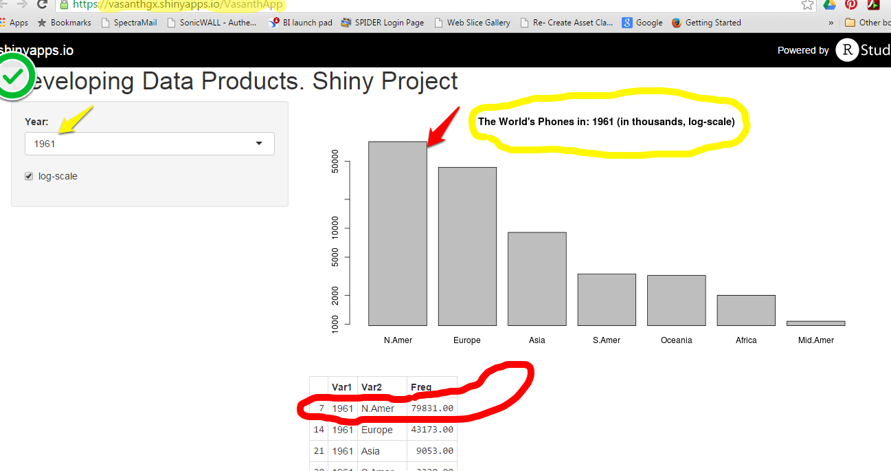
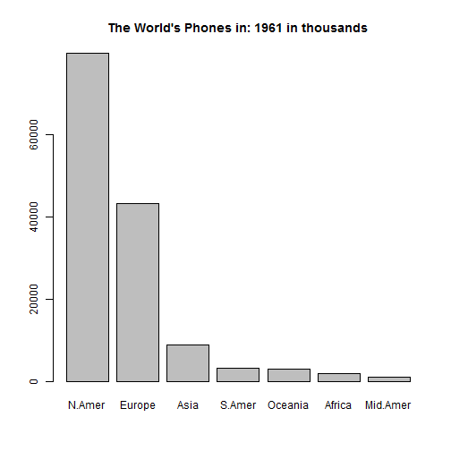

Developing-Data-Products Presentation,
World-Phones Project
========================================================
author: Vasanth
date: JUne 17, 2014
transition: zoom

2. World Phones Shiny-Application
========================================================
- The app is available at: https://vasanthgx.shinyapps.io/VasanthApp
- It uses the [WorldPhones](http://vincentarelbundock.github.io/Rdatasets/doc/datasets/WorldPhones.html) data from the R "datasets" library.
- The app allows for simple exploration of the data by specifying the year of interest.

3. Documention is available via the NavBar at the top:
========================================================
  


4. R Barplot example:
========================================================

```r
library(datasets)
wp <- subset(data.frame(as.table(WorldPhones)), Var1=="1961")
barplot(wp$Freq, names.arg = wp$Var2,
        main=paste("The World's Phones in: 1961 in thousands"))
```

 

5. Quiz:
========================================================
### Which country improved their WorldPhones standing the most in the early 1950's?
(hint: use the log-scale setting)
